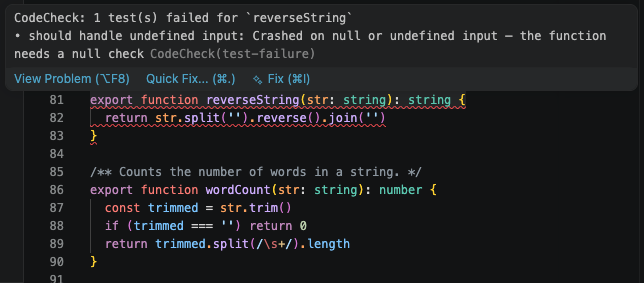

# CodeCheck

**Your code tests itself.**

CodeCheck is a modular AI testing tool that reads your code, generates meaningful tests, runs them, and reports results — automatically, on every commit, push, or save. No test files to write. No framework to learn.

https://github.com/user-attachments/assets/513d05fe-2287-4440-9ea8-daa74fc82fdc

```bash
npm install -D @codecheck/trigger-oncommit @codecheck/scope-unit @codecheck/output-terminal
npx codecheck-init
```

```
git commit -m "feat: add payment processor"

  ◆ CodeCheck  claude-sonnet-4-6 · unit + smoke

  src/payment.ts
    ✓ processPayment succeeds with valid card details       14ms
    ✓ processPayment throws on expired card                  9ms
    ✓ processPayment handles zero amount                    11ms
    ✓ processPayment returns transaction ID on success      13ms
    ✗ processPayment handles null billing address            8ms
      → Crashed on null or undefined input — the function needs a null check
        AssertionError: expected undefined to equal "billing required"

  4 passed · 1 failed · 80% pass rate ─ below threshold (80%)

[commit proceeds — failOnError is false]
```

---

## What CodeCheck does

1. **Reads your changed files** — on commit, push, or save, CodeCheck extracts every function and class
2. **Calls an AI model** — Claude, OpenAI, Gemini, or a local Ollama model reads the code and generates test cases covering happy paths, edge cases, null checks, and boundary conditions
3. **Runs the tests** — generated tests run immediately with your existing test framework (Jest, Vitest, or Pytest)
4. **Reports results** — colored terminal output, GitHub PR comments, Slack notifications, HTML reports, or a live web dashboard
5. **Learns from history** — after a few runs, CodeCheck adapts its test generation to focus on the patterns that have historically caught bugs in your codebase

Your workflow is unchanged. You commit code. CodeCheck handles the rest.

---

## Install

### Quick start (recommended)

```bash
npm install -D \
  @codecheck/trigger-oncommit \
  @codecheck/scope-unit \
  @codecheck/scope-smoke \
  @codecheck/output-terminal

npx codecheck-init
```

The init wizard asks a few questions and sets up your config and git hook in under a minute.

### Set your API key

```bash
# Claude (default)
export ANTHROPIC_API_KEY=sk-ant-...

# OpenAI
export OPENAI_API_KEY=sk-...

# Google Gemini
export GEMINI_API_KEY=...

# Ollama (local, no key needed — just run Ollama locally)
# Uses http://localhost:11434 by default
```

---

## Configuration

Add a `codecheck` block to `package.json`, or create `codecheck.config.json`:

```json
{
  "codecheck": {
    "trigger": "oncommit",
    "testTypes": ["unit", "smoke"],
    "output": ["terminal"],
    "provider": "anthropic",
    "model": "claude-sonnet-4-6",
    "language": "typescript",
    "framework": "jest",
    "threshold": 0.8,
    "failOnError": false,
    "exclude": ["dist", "*.generated.ts"]
  }
}
```

| Key | Type | Default | Description |
|---|---|---|---|
| `trigger` | `string` | `oncommit` | When to run — `oncommit`, `onsave`, `onpush`, `ci` |
| `testTypes` | `string[]` | `["unit","smoke"]` | Which test types to generate. See [Test Types](#test-types) |
| `output` | `string[]` | `["terminal"]` | Where to report. See [Outputs](#outputs) |
| `provider` | `string` | `anthropic` | AI provider — `anthropic`, `openai`, `gemini`, `ollama` |
| `model` | `string` | `claude-sonnet-4-6` | Model name (any model from the chosen provider) |
| `language` | `string` | `typescript` | Source language — `typescript`, `javascript`, `python` |
| `framework` | `string` | `jest` | Test runner — `jest`, `vitest`, `pytest` |
| `threshold` | `number` | `0.8` | Minimum pass rate (0–1) before warning or failing |
| `failOnError` | `boolean` | `false` | Set to `true` to block commits/pushes below threshold |
| `exclude` | `string[]` | `["node_modules","dist"]` | File patterns to skip |
| `concurrency` | `number` | `3` | Max parallel AI calls per run |
| `cacheTtlDays` | `number` | `7` | Reuse LLM results for unchanged functions for N days |
| `keepGeneratedTests` | `boolean` | `false` | Keep generated files after the run (for debugging) |

---

## AI Providers

### Anthropic (Claude) — default

```json
{ "provider": "anthropic", "model": "claude-sonnet-4-6" }
```

```bash
export ANTHROPIC_API_KEY=sk-ant-...
```

### OpenAI

```json
{ "provider": "openai", "model": "gpt-4o" }
```

```bash
export OPENAI_API_KEY=sk-...
```

### Google Gemini

```json
{ "provider": "gemini", "model": "gemini-1.5-pro" }
```

```bash
export GEMINI_API_KEY=...
```

### Ollama (local, free, private)

No API key needed. Just [install Ollama](https://ollama.ai) and pull a model:

```bash
ollama pull llama3.2
```

```json
{ "provider": "ollama", "model": "llama3.2" }
```

By default CodeCheck connects to `http://localhost:11434`. Override with:

```bash
export OLLAMA_BASE_URL=http://my-server:11434/v1
```

---

## Triggers

Triggers control **when** CodeCheck runs.

### `oncommit` — git pre-commit hook

Runs on every `git commit`. Tests only the files you are staging — not the entire repo.

```bash
npm install -D @codecheck/trigger-oncommit

# Add to .husky/pre-commit:
echo "npx codecheck" > .husky/pre-commit
```

```bash
# Preview what would run without calling the AI
npx codecheck --dry-run
```

### `onsave` — file watcher

Runs continuously while you code. Every time you save a file, CodeCheck tests it.

```bash
npm install -D @codecheck/trigger-onsave

npx codecheck-watch
npx codecheck-watch ./src          # watch a specific directory
npx codecheck-watch --dry-run      # watch without testing
```

### `onpush` — git pre-push hook

Runs before a push goes to the remote. Tests all commits being pushed — a broader gate than the commit hook.

```bash
npm install -D @codecheck/trigger-onpush

# Add to .husky/pre-push:
echo "npx codecheck-push" > .husky/pre-push
```

### `ci` — GitHub Actions (and other CI)

Runs in your CI pipeline. Detects changed files automatically from the CI environment, posts results as a GitHub PR comment, and writes a step summary.

```bash
npm install -D @codecheck/trigger-ci
```

```yaml
# .github/workflows/codecheck.yml
name: CodeCheck
on: [pull_request, push]

jobs:
  codecheck:
    runs-on: ubuntu-latest
    steps:
      - uses: actions/checkout@v4
        with:
          fetch-depth: 0
      - uses: actions/setup-node@v4
        with:
          node-version: 20
      - run: npm ci
      - run: npx codecheck-ci
        env:
          ANTHROPIC_API_KEY: ${{ secrets.ANTHROPIC_API_KEY }}
          GITHUB_TOKEN: ${{ secrets.GITHUB_TOKEN }}
```

---

## Test Types

Test types control **what** CodeCheck generates for each function.

Install only the types you need:

```bash
npm install -D \
  @codecheck/scope-unit \
  @codecheck/scope-smoke \
  @codecheck/scope-functional
```

| Type | Package | What it generates |
|---|---|---|
| `unit` | `@codecheck/scope-unit` | Happy path, edge cases, null checks, boundary conditions, type errors, error conditions |
| `smoke` | `@codecheck/scope-smoke` | The single most critical path — does it run and return the right shape? |
| `functional` | `@codecheck/scope-functional` | Input/output behavior with real (non-mocked) logic |
| `sanity` | `@codecheck/scope-sanity` | Can the function be called at all? Returns something non-null? |
| `integration` | `@codecheck/scope-integration` | How this function interacts with its real dependencies |
| `api` | `@codecheck/scope-api` | HTTP request/response, status codes, error handling |
| `e2e` | `@codecheck/scope-e2e` | Full browser user flows via Playwright |
| `snapshot` | `@codecheck/scope-snapshot` | React component rendering snapshots |
| `regression` | `@codecheck/scope-regression` | Re-tests functions that previously failed — sorted to the front of every run |
| `everything` | `@codecheck/scope-everything` | Runs all test types across the **entire** codebase, not just changed files |

> **Tip:** Start with `["unit", "smoke"]`. Add more types when you want broader coverage.

---

## Outputs

Outputs control **how** results are reported. You can use multiple at once.

```json
{ "output": ["terminal", "github", "slack"] }
```

### Terminal (default)

```bash
npm install -D @codecheck/output-terminal
```

Colored pass/fail output in the terminal with plain-English error descriptions.

```
  src/utils.ts
    ✓ capitalize returns Hello for hello                    8ms
    ✗ capitalize handles null input                         5ms
      → Crashed on null or undefined input
        TypeError: Cannot read properties of null
```

### GitHub PR Comment

```bash
npm install -D @codecheck/output-github
```

Posts a formatted comment on the open PR with a full pass/fail table. Updates the same comment on re-runs.

Requires: `GITHUB_TOKEN`, `GITHUB_REPO` (owner/repo), `GITHUB_PR` (PR number).

### Slack

```bash
npm install -D @codecheck/output-slack
```

Posts a summary message to a Slack channel after each run.

```bash
export SLACK_WEBHOOK_URL=https://hooks.slack.com/services/...
```

Optional: `SLACK_CHANNEL`, `SLACK_USERNAME`.

### HTML + JSON Report

```bash
npm install -D @codecheck/output-report
```

Writes two files after every run:
- `.codecheck-results/report.html` — human-readable summary page, open in any browser
- `.codecheck-results/report.json` — machine-readable full results for CI integrations

### Web Dashboard

```bash
npm install -D @codecheck/output-dashboard
npx codecheck-serve
# → http://localhost:3333
```

A local web dashboard with:
- Live pass rate and counts
- Run history trend chart
- Flakiness detection (functions that flip between pass and fail)
- Auto-refreshes every 5 seconds

```bash
npx codecheck-serve --port 8080
```

### VS Code Inline Diagnostics

`@codecheck/output-inline` is a VS Code extension that shows red underlines on functions whose tests failed — like ESLint, but for CodeCheck results.



```bash
cd packages/output-inline
npx @vscode/vsce package
code --install-extension codecheck-output-inline-0.1.0.vsix
```

The extension watches `.codecheck-results/latest.json` and updates diagnostics in real time as CodeCheck runs.

---

## Languages

### TypeScript / JavaScript

Works out of the box. Generates Jest or Vitest test files.

```json
{ "language": "typescript", "framework": "jest" }
```

### Python

```json
{ "language": "python", "framework": "pytest" }
```

```bash
pip install pytest pytest-asyncio
```

---

## Adaptive Learning

After 3 or more runs, CodeCheck starts learning from your project's test history. It reads `.codecheck-results/project-profile.json` and adjusts what it generates:

- **Higher pass rates** in certain categories → generate more of those
- **Common failure patterns** → add specific instructions to avoid them  
- **Proven examples** → include real examples from your codebase in the prompt

This happens automatically. There is nothing to configure. The profile is stored per-project and never shared.

---

## How it works under the hood

```
git commit
    │
    ▼
[trigger-oncommit]
 reads staged files
    │
    ▼
[scope-unit, scope-smoke, ...]
 extracts function signatures + code
    │
    ▼
[core engine]
 checks cache → calls AI → validates JSON
    │
    ▼
[generator]
 writes Jest/Vitest/Pytest test files to .codecheck-tmp/
    │
    ▼
[runner]
 executes tests, captures pass/fail/duration
    │
    ▼
[output-terminal, output-github, ...]
 renders results
    │
    ▼
commit proceeds (or blocks if failOnError + below threshold)
```

Generated test files go to `.codecheck-tmp/` and are deleted after each run. They never touch your source tree. Everything in your repo stays exactly as you wrote it.

---

## Safety guarantees

CodeCheck is designed to **never block your work due to its own failures**.

- Any unexpected error (network down, bad API response, config missing) → CodeCheck skips and lets the commit/push through
- `failOnError: false` (default) → CodeCheck never blocks commits regardless of test results
- `failOnError: true` → only blocks if the pass rate is genuinely below your threshold
- Each output plugin is isolated — a Slack failure never affects terminal output
- The AI response is validated against a strict schema — malformed JSON is caught and skipped, never crashes the run

---

## Packages

| Package | Description |
|---|---|
| `@codecheck/core` | AI engine — extract functions, call AI, generate tests, run them |
| **Triggers** | |
| `@codecheck/trigger-oncommit` | Git pre-commit hook |
| `@codecheck/trigger-onsave` | File watcher (runs as you code) |
| `@codecheck/trigger-onpush` | Git pre-push hook |
| `@codecheck/trigger-ci` | CI pipeline runner (GitHub Actions, GitLab CI, etc.) |
| **Scopes** | |
| `@codecheck/scope-unit` | Unit test generator |
| `@codecheck/scope-smoke` | Smoke test generator |
| `@codecheck/scope-functional` | Functional test generator |
| `@codecheck/scope-sanity` | Sanity test generator |
| `@codecheck/scope-integration` | Integration test generator |
| `@codecheck/scope-api` | API endpoint test generator |
| `@codecheck/scope-e2e` | Playwright E2E test generator |
| `@codecheck/scope-snapshot` | React snapshot generator |
| `@codecheck/scope-regression` | Regression test generator (prioritizes previous failures) |
| `@codecheck/scope-everything` | Full codebase sweep — tests everything, not just changed files |
| **Outputs** | |
| `@codecheck/output-terminal` | Colored terminal output |
| `@codecheck/output-github` | GitHub PR comment |
| `@codecheck/output-slack` | Slack notification |
| `@codecheck/output-report` | HTML + JSON report files |
| `@codecheck/output-dashboard` | Local web dashboard with history + flakiness |
| `@codecheck/output-inline` | VS Code extension — inline diagnostics |
| **Tools** | |
| `@codecheck/init` | Interactive setup wizard (`npx codecheck-init`) |

---

## FAQ

**Does CodeCheck block my commits?**  
No, by default. The commit always goes through unless you set `failOnError: true` and your pass rate drops below `threshold`. Even then — if CodeCheck itself crashes for any reason, the commit proceeds.

**Is my code sent to an external server?**  
Only if you use a cloud provider (Anthropic, OpenAI, Gemini). Only the specific function being tested is sent — not your entire codebase. Use Ollama for fully local, fully private test generation with no data leaving your machine.

**Does it modify my source files?**  
Never. Generated test files go to `.codecheck-tmp/` and are deleted after the run. Your source tree is untouched.

**What if the AI generates a wrong test?**  
Wrong tests fail, which counts against your pass rate. They are deleted when the run ends. You can set `keepGeneratedTests: true` to inspect them, or raise your threshold to require higher accuracy before the run is considered passing.

**Does it work on large repos?**  
Yes. The commit hook only tests staged files — not the whole repo. Unchanged functions are cached (default: 7 days) and never re-sent to the AI. Use `scope-everything` with the CI trigger if you want a periodic full sweep.

**Can I use it with an existing test suite?**  
Yes. CodeCheck generates and runs tests in a temporary directory — it has no awareness of your existing tests and does not interfere with them. Run `npm test` normally; CodeCheck is a separate process.

**What languages are supported?**  
TypeScript, JavaScript, and Python. Jest, Vitest, and Pytest test runners.

---

## Documentation

- [Quick Start (5 minutes)](docs/quickstart.md)
- [Configuration Reference](docs/configuration.md)
- [Plugin Authoring Guide](docs/plugins.md)

---

## Contributing

```bash
git clone https://github.com/medhavee-upadhyaya/codecheck
cd codecheck
npm install
npm run build
npm test
```

This is a monorepo. Each package lives in `packages/`. All packages use TypeScript with ESM and are tested with Vitest.

---

## License

MIT © [Medhavee Upadhyaya](https://github.com/medhavee)
